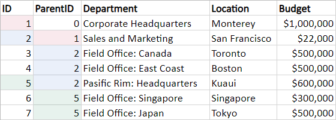

<!-- default badges list -->

<!-- default badges end -->

# Reporting for WinForms - How to create a hierarchical report based on data stored in a flat table

This example illustrates how to create a hierarchical tree-like report based on data stored in a flat table. Data must meet certain requirements. Two additional fields are necessary to build a tree structure. The first field must contain unique values. The second field must contain values that indicate parent nodes for the current node. Here is a sample image illustrating the required structure.

 
The example's main report has the `Level` parameter to store the quantity of levels of hierarchical data. A value of this parameter is used to generate the initial data table. When the data table has been generated, it is converted to a hierarchical list of custom objects that is used as a report data source. The main report contains an [XRSubreport](https://docs.devexpress.com/XtraReports/DevExpress.XtraReports.UI.XRSubreport) instance that refers to the detail report. The detail report in its turn contains an `XRSubreport` instance that recursively refers to itself.

## Files to Review

* [ChildReport.cs](./CS/TreeViewReport/ChildReport.cs) (VB: [ChildReport.vb](./VB/TreeViewReport/ChildReport.vb))
* [DataHelper.cs](./CS/TreeViewReport/DataHelper.cs) (VB: [DataHelper.vb](./VB/TreeViewReport/DataHelper.vb))
* [Form1.cs](./CS/TreeViewReport/Form1.cs) (VB: [Form1.vb](./VB/TreeViewReport/Form1.vb))
* [Program.cs](./CS/TreeViewReport/Program.cs) (VB: [Program.vb](./VB/TreeViewReport/Program.vb))
* [TreeReport.cs](./CS/TreeViewReport/TreeReport.cs) (VB: [TreeReport.vb](./VB/TreeViewReport/TreeReport.vb))
<!-- default file list end -->

## Documentation

- [Create a Hierarchical Report](https://docs.devexpress.com/XtraReports/400925/create-popular-reports/create-a-hierarchical-report)

## More Examples

- [Reporting for WinForms - How to create a Hierarchical Report in Code](https://github.com/DevExpress-Examples/Reporting-Create-a-Hierarchical-Report-in-Code)
